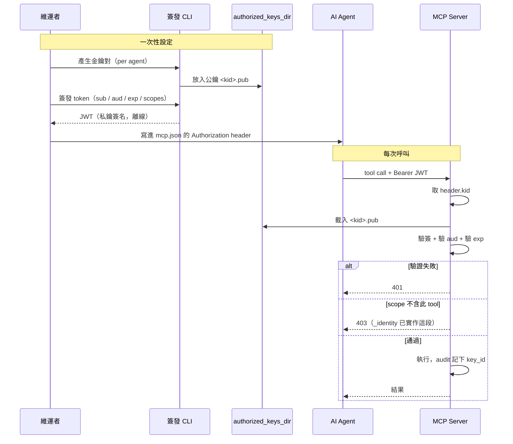

# 認證與授權

> 狀態：**未實作**。`build_server`（`src/server.py:29`）在 `require_auth=True` 時
> 直接 raise `NotImplementedError`（`:38`）並指向這份文件。這裡描述選定的設計，
> 對應 [inventory-roadmap.md](inventory-roadmap.md) 的 Phase 5。

## 威脅模型

要防的是「拿到 URL 的人（或 AI agent）就能連進來讀資料庫」。

- **stdio 不在防護範圍內。** 能 spawn 這個 process 的人本來就拿得到它的環境變數，
  也就拿得到 DB 憑證。`ServerConfig._check_auth_matches_transport`（`src/core/config.py:79`）
  已經把 `require_auth=True` + stdio 判為設定錯誤。
- **要防的只有 http transport。** 同一個 validator 也擋住「非 loopback + 未認證」，
  除非顯式設 `allow_insecure_http=True`。

真正的安全收益是**DB 憑證只存在 server 端**：使用者的 `mcp.json` 裡只有一張 token，
沒有任何資料庫密碼。認證機制存在的目的是讓那張 token 可被驗證、可被限縮、可被撤銷。

## 為什麼不是「client 放公鑰、server 放私鑰」

那個組合是**加密**（誰都能用公鑰加密，只有持私鑰者能解），不是認證。
認證要的是反方向：**client 持私鑰簽名，server 用公鑰驗簽**——只有簽得出有效簽章的人
才是被授權的那一方。

但 `mcp.json` 只能塞靜態 header 或跑 OAuth，**沒辦法在 client 端做簽章運算**。
所以簽章這一步要挪到離線。

## 選定方案：離線簽發 JWT + server 端公鑰目錄



私鑰**只存在簽發者手上**，不進 repo、不進 server、不進 `mcp.json`。
server 端只需要公鑰，所以 server 被入侵也簽不出新 token。

### Token claims

| claim | 用途 |
|---|---|
| `kid`（header） | 對應 `authorized_keys_dir` 下的公鑰檔名 |
| `sub` | agent 身分，成為 audit 的 `key_id`（取代目前恆為 `"local"` 的行為） |
| `aud` | 必須等於 `config.audience`（預設 `etl-agent-mcp`），避免別處簽的 token 被拿來用 |
| `exp` | 必填。過期就重簽，這是最主要的撤銷手段 |
| `scopes` | 見下 |

### 公鑰目錄佈局

```
<authorized_keys_dir>/
  pm-explorer.pub       # kid = pm-explorer
  de-inventory.pub      # kid = de-inventory
```

檔名即 `kid`。要撤銷一個 agent 就刪掉它的公鑰檔——比等 `exp` 到期快，
且不需要重啟（載入時不快取，或快取帶短 TTL）。

### Scopes

`_identity()`（`src/server.py:68`）目前把 scopes 當成一串 tool 名稱檢查，這是最小可用版本，
但粒度對「開放給 PM」來說太粗。Phase 4 要擴成結構化的授權：

```python
{
  "tools": ["list_containers", "get_schema", "inventory_search", ...],
  "databases": ["analytics"],            # 允許的 database，空 = 全部
  "containers": {"allow": ["dim_*", "fct_*"], "deny": ["*_pii"]},
  "allow_raw_sample": false,             # false → get_sample 一律遮罩
  "annotate_as_human": false             # false → 寫回的描述標記為 ai
}
```

原則：**判斷細節可以交給 skill，但「這個 key 准不准看原始列」必須寫死在程式。**

## 替代方案

- **OAuth 2.1 / DCR**（MCP 規格的方向，FastMCP 有 remote auth provider 支援）——
  若組織已經有 Okta / Entra / Google Workspace，這條比自管公鑰目錄輕鬆得多，
  也自帶撤銷與稽核。沒有 IdP 就別自己架一個。
- **反向代理做 mTLS**——完全不動應用程式碼，適合網路層本來就受管的環境。
  缺點是 server 拿不到「誰」，audit 的 `key_id` 就仍然是空的。

## 待決

- **時鐘偏移**：`exp` 驗證要不要給 leeway（建議 60s）。
- **公鑰載入快取**：不快取則每次呼叫讀檔；快取則撤銷有延遲。傾向短 TTL（30s）。
- **audit log rotation**：`AuditLogger` 目前一直 append 同一個檔（`src/service/audit.py:83`），
  認證上線後這個檔會變成合規證據，需要 rotation 與保存期限政策。
