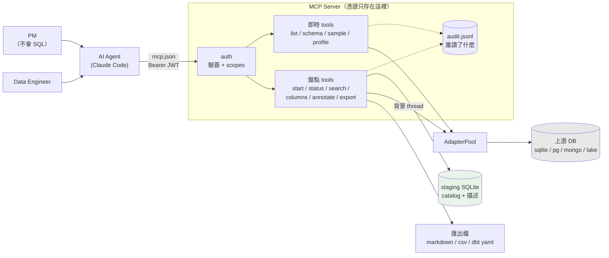
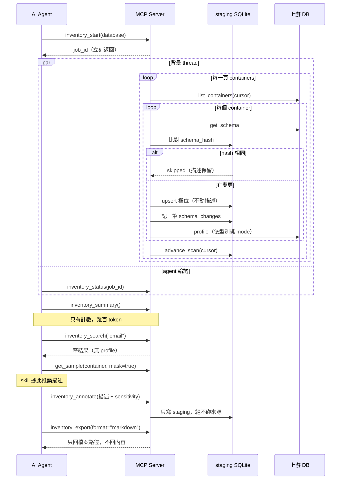
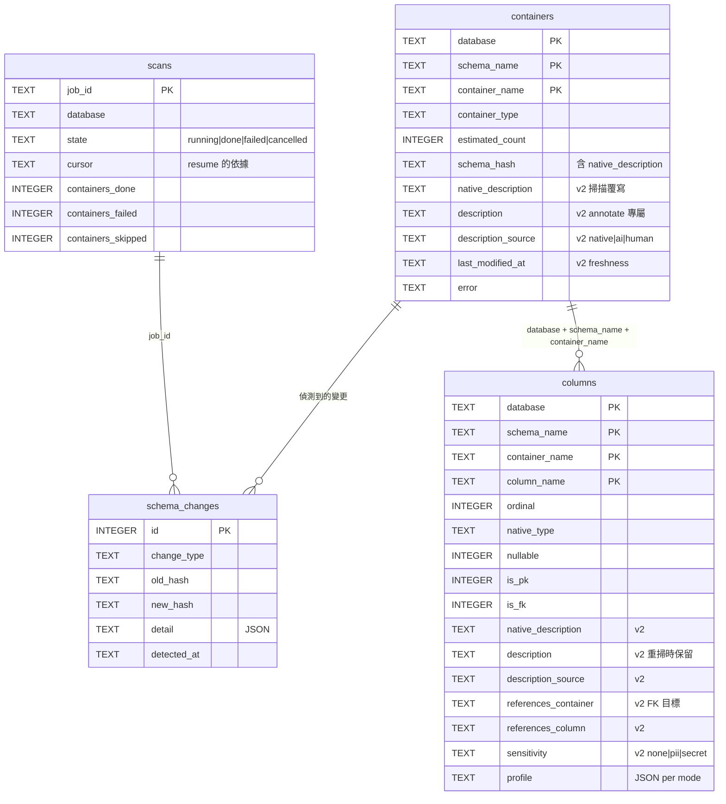

# 資料盤點服務規劃

> 狀態：規劃中。這份文件描述目標狀態與執行順序，不是現況說明。
> 標「已備」的是程式裡真的存在的東西，其餘皆未實作。

## Context

這個服務的目的是**讓上游資料源的欄位、型別與描述能被快速盤點**，服務兩種使用者：

- **Data Engineer** 要「全盤」——一次拿到整個 catalog 的廣度
- **PM**（不會 SQL）要「探索」——透過 AI agent 代寫查詢，一次問一小塊

附帶但關鍵的性質：**DB 憑證只存在 server 端**，使用者的 `mcp.json` 裡永遠沒有密碼。

現況是骨架不錯但主打功能缺席，且服務跑不起來：

| 問題 | 位置 | 影響 |
|---|---|---|
| 沒有任何地方能存「描述」 | `src/core/contracts.py:38`、`src/service/staging.py:55` | 主打的「欄位/型別/描述」少了描述 |
| `main.py` 只 `load_repo_dotenv()` 就 return | `main.py:6` | `build_server` 除測試無呼叫者，repo 跑不起來 |
| registry 註冊 8 個引擎、只有 2 個模組存在（`datalake`、`remote_mcp`），而預設 engine 是 sqlite | `src/service/factory.py:10` | 開箱即壞 |
| 沒有搜尋入口 | — | PM 只能一頁頁翻 `inventory_containers` 進 context |
| `inventory_columns` 無分頁無上限 | `src/server.py:262` | 寬表 + profile 一次數萬 token |
| `_require_container` 每次都全掃 catalog | `src/adapter/base.py:83`、`:134` | 接上 postgres 後每個 `get_sample` 都全掃一次 |
| `replace_columns` 是 DELETE + INSERT | `src/service/staging.py:329` | **加了描述之後，每次重掃都會把描述清掉** |
| `get_sample` 直接回原始列 | `src/server.py:145` | 開放給 PM 等於個資直接進 LLM context |

預期成果：一個裝得起來、跑得動、能對 sqlite/postgres 盤點出**帶描述的資料字典**、
且盤點結果不會撐爆 agent context 的 MCP server。

## 目標架構



分工原則：**機械性的預算寫死在程式**（分頁上限、profile 選擇、匯出），
**判斷性的工作交給 skill**（描述文字、語意分群、哪些表值得深挖）。
context 爆掉是機械性問題，靠 LLM 自律不可靠；描述才真的需要它思考。

盤點與描述生成的迴路：



## Phase 0 — 先讓它跑起來

沒有這一步，後面每一項都無法驗證。

**`main.py`：真正的進入點**

- `argparse` + 環境變數組出 `ServerConfig`，建 `AdapterPool`、`StagingStore`、
  `InventoryService`，呼叫既有的 `build_server`，依 `config.transport` 起 stdio 或 http。
- 建 `StagingStore` 時把 `source_path=conn_info.path` 帶進去，
  既有的 `_reject_source_overlap`（`staging.py:79`）才會生效。

**`ServerConfig` 補三個欄位**（`src/core/config.py:58`）

- `staging_db_path: Path | None`——`staging.py:88` 的錯誤訊息已經在提 `STAGING_DB`，但 config 沒這欄
- `export_dir: Path | None`——未設定時 `inventory_export` 不註冊（見 Phase 2）
- `profile_modes: list[ProfileMode] | None`——掃描預設

**`src/adapter/sqlite.py`**：最便宜的真實引擎，也讓所有測試有真 DB 可跑。

- 繼承 `SqlAdapterBase`（quoting / `_PARAM` / SQL templates 都已備好）
- `list_containers` 走 `sqlite_master`；`estimated_count` 用 `COUNT(*)`（sqlite 便宜）
- `get_schema` 用 `PRAGMA table_info` + **`PRAGMA foreign_key_list`**——後者直接給出
  Phase 3 要的 FK 目標，不只是 `is_fk` 布林
- sqlite 沒有 column comment，`native_description` 永遠 None——正好是 AI 描述存在的理由
- `SUPPORTS_MULTIPLE_DATABASES = False`

**修 `_known_containers()` 的全掃**（`src/adapter/base.py:83`）

- 加 TTL cache（預設 60s）於 `AdapterBase`，`_require_container` / `_require_column` 共用；
  `_require_column` 目前每次都重新 `get_schema`，一併納入
- 盤點時是「每容器每欄位」在呼叫它，接上 postgres 會直接痛

**`README.md`**（目前 0 bytes）：定位、快速上手、`uv sync --extra` 對照表。

## Phase 1 — 描述：資料模型與寫回

這是產品定位所在。`grep -rn "description\|comment" src/` 目前是零筆。

### 1.1 contracts 擴充（`src/core/contracts.py`）

全部給 default，既有 adapter（`datalake.py:210`）不改也能編譯：

```python
class ColumnInfo(BaseModel):
    # 既有：name / ordinal / native_type / nullable / is_pk / is_fk
    native_description: str | None = None   # 來源 DB 的 comment，adapter 填
    references_container: str | None = None # FK 目標（Phase 3 用滿）
    references_column: str | None = None

class ContainerInfo(BaseModel):
    # 既有：database / schema_name / container_name / container_type / estimated_count
    native_description: str | None = None
    last_modified_at: str | None = None     # freshness，來源回報得到才填
```

各引擎的 native comment 來源：pg `col_description()` / `obj_description()`、
mysql `information_schema.COLUMNS.COLUMN_COMMENT`、mssql extended properties、
sqlite 無、datalake 偶爾在 parquet metadata。

### 1.2 staging schema v2（`src/service/staging.py`）

`SCHEMA_VERSION` 1 → 2。**兩類描述必須分開存**，這是整個設計的關鍵：

| 欄位 | 誰寫 | 進 schema_hash？ | 重掃時 |
|---|---|---|---|
| `native_description` | adapter 從來源讀 | **是** | 覆寫 |
| `description` | AI / 人（annotate） | **否** | **保留** |

`native_description` 進 hash，才不會「comment 改了但欄位沒改」被 skip 掉；
AI 描述不進 hash，否則自己寫回去會觸發無限重掃。

```sql
ALTER TABLE containers ADD COLUMN native_description TEXT;
ALTER TABLE containers ADD COLUMN description TEXT;
ALTER TABLE containers ADD COLUMN description_source TEXT;   -- native | ai | human
ALTER TABLE containers ADD COLUMN description_updated_at TEXT;
ALTER TABLE containers ADD COLUMN last_modified_at TEXT;

ALTER TABLE columns ADD COLUMN native_description TEXT;
ALTER TABLE columns ADD COLUMN description TEXT;
ALTER TABLE columns ADD COLUMN description_source TEXT;
ALTER TABLE columns ADD COLUMN description_updated_at TEXT;
ALTER TABLE columns ADD COLUMN references_container TEXT;
ALTER TABLE columns ADD COLUMN references_column TEXT;
ALTER TABLE columns ADD COLUMN sensitivity TEXT;             -- Phase 4
ALTER TABLE columns ADD COLUMN sensitivity_source TEXT;

CREATE INDEX IF NOT EXISTS columns_by_name ON columns (column_name);
```

**版本升級策略**：不寫 migration。`_claim_or_reject`（`staging.py:190`）增加一條——
讀到 `version < SCHEMA_VERSION` 就明確報錯，要求刪檔重掃。盤點結果是可重生的衍生資料，
migration 鏈的維護成本換不到價值。錯誤訊息要直接寫出「刪掉 `<path>` 後重新
`inventory_start`」。`schema_hash` 納入 `native_description` 後既有 hash 全數失效，
本來就得全掃一次，時機正好一致。

### 1.3 `replace_columns` 改成 UPSERT（關鍵陷阱）

`staging.py:329` 現在是 `DELETE` 全部欄位再 `INSERT`。加了描述之後，
**每次重掃都會把 AI 寫的描述連同上一輪的 profile 一起清掉**。改法：

```sql
INSERT INTO columns (...) VALUES (...)
ON CONFLICT (database, schema_name, container_name, column_name) DO UPDATE SET
    ordinal=excluded.ordinal, native_type=excluded.native_type,
    nullable=excluded.nullable, is_pk=excluded.is_pk, is_fk=excluded.is_fk,
    native_description=excluded.native_description,
    references_container=excluded.references_container,
    references_column=excluded.references_column,
    scanned_at=excluded.scanned_at
-- description / description_source / sensitivity / profile 一律不觸碰
```

真的消失的欄位仍要清掉，所以緊接一句
`DELETE FROM columns WHERE <container> AND column_name NOT IN (...)`。
測試要明確斷言：annotate 之後 force rescan，`description` 仍在。

### 1.4 `inventory_annotate`（新 write tool）

這是 server 第一個寫入 tool，界線必須寫死在程式與文件裡：**只寫 staging，永不觸及來源 DB**。

```python
@mcp.tool
def inventory_annotate(
    database: str,
    container: str,
    schema: str | None = None,
    container_description: str | None = None,
    columns: list[ColumnAnnotation] | None = None,   # {column, description, sensitivity?}
) -> AnnotateResult:  # {containers_updated, columns_updated, unknown_columns}
```

- `description_source` **由 server 決定**，不讓 caller 自稱 `human`：有 token 且
  scope 含 `annotate:human` 才是 human，否則 `ai`
- 未知欄位不靜默忽略，回報在 `unknown_columns`，agent 才知道自己記錯了表名
- audit 記每筆寫入量：`ctx.extra["columns_written"]`
- scope 名稱 `inventory_annotate` 已自動被 `_identity()`（`server.py:68`）的檢查涵蓋

### 1.5 profile 依型別挑 mode

`InventoryService._scan_container`（`inventory.py:205`）現在是「每欄 × 每 mode」全跑。
對 text 欄做 `min_max`、對高基數欄做 `top_values` 都是純浪費往返。
在 `AdapterBase` 加 `_default_profile_modes(column) -> tuple[ProfileMode, ...]`：

- 數值 / 時間 → `min_max` + `null_ratio`
- 文字 → 先 `distinct_count`，超過閾值（預設 200）就跳過 `top_values`
- 呼叫端顯式傳 `profile_modes` 時尊重呼叫端

## Phase 2 — Context 控制：搜尋、分頁、匯出

**掃描成本**這一塊現況已經不錯（背景 thread、per-container cursor、`resume`、
`schema_hash` skip、WAL、單容器失敗不致命）。洞在**進 context 的量**，而且根因不是
資料太大，是缺少正確的過濾入口。

### 2.1 `inventory_search`——PM 的真正入口

```python
@mcp.tool
def inventory_search(
    keyword: str,
    database: str | None = None,
    kind: Literal["all", "container", "column"] = "all",
    limit: int = 50,
) -> list[SearchHit]
```

`SearchHit` 刻意窄：`{database, schema_name, container_name, column_name?, native_type?,
description?, match_in: "name" | "description"}`——**不帶 profile**。

實作用 `LIKE` + `columns_by_name` index，不用 FTS5：200k 列的 LIKE 全掃在 SQLite 是
數十毫秒，而 FTS5 要處理索引同步（`replace_columns` / `annotate` 兩處）與
「CPython 是否編進 FTS5」的可用性問題。等真的量測到慢再換。

### 2.2 `inventory_columns` 加分頁與 profile 開關

`server.py:262` 目前無上限。改為
`(container, database, schema=None, limit=100, cursor=None, include_profile=True)`，
回傳型別跟著改成分頁 model。`include_profile=False` 是寬表的逃生門。

### 2.3 `inventory_export`——真正的解法是別放進 context

```python
@mcp.tool
def inventory_export(
    format: Literal["markdown", "csv", "dbt_yaml"] = "markdown",
    database: str | None = None,
    path: str | None = None,
) -> ExportResult   # {path, bytes_written, containers, columns}
```

- **只回傳寫到哪，不回傳內容**——這是 context 控制的核心，也是「快速全盤」真正的交付物
- 寫入路徑必須落在 `config.export_dir` 之下（`Path.resolve()` 後檢查），
  未設定 `export_dir` 就**不註冊這個 tool**（比在 runtime 報錯乾淨）
- `markdown` = 人讀的 data dictionary；`dbt_yaml` = 可直接進 dbt 專案的 `schema.yml`

## Phase 3 — 關聯與變更歷史

**FK 目標**：`is_fk` 只是布林（datalake 甚至永遠 `False`）。PM 探索資料庫的第一個問題
就是「這兩張表怎麼串」。Phase 1 已把 `references_container` / `references_column`
加進 model，這裡讓 sqlite（`PRAGMA foreign_key_list`）與 postgres
（`information_schema.referential_constraints`）真的填滿，並加
`inventory_relationships(database)` 回傳邊清單（agent 可據此產 ER 圖）。

**schema drift**：`schema_hash` 只留最新狀態，比完就丟。但 DE 最常問的是
「上游這週改了什麼」。新增 append-only 表，成本極低——hash 本來就算出來了：

```sql
CREATE TABLE IF NOT EXISTS schema_changes (
    id INTEGER PRIMARY KEY AUTOINCREMENT,
    job_id TEXT NOT NULL, database TEXT NOT NULL,
    schema_name TEXT NOT NULL, container_name TEXT NOT NULL,
    change_type TEXT NOT NULL,          -- container_added | container_removed | schema_changed
    old_hash TEXT, new_hash TEXT,
    detail TEXT,                        -- JSON：新增/移除/改型別的欄位
    detected_at TEXT NOT NULL
);
```

搭配 `inventory_changes(database=None, since=None, limit=100)`。
`container_removed` 需要在一輪掃描結束時比對「這次沒看到但 staging 有」的容器。

staging schema v2 全貌：



## Phase 4 — PII 與授權（開放給 PM 的前提）

不是加值功能，是前置條件：`get_sample` 直接回原始列，PM + AI agent 探索 users 表
就等於真實個資進 LLM context 與各種下游記錄。

- **偵測**：欄名 pattern（email/phone/ssn/身分證/address/card）+ 樣本值 regex，
  盤點時寫進 `columns.sensitivity`；`inventory_annotate` 允許 agent 修正
- **遮罩**：`get_sample(container, limit, mask=True)` 為預設；被判為 pii 的欄位
  以型別保留的方式遮蔽（`a***@***.com`）
- **授權**：現在的 scopes 只是一串 tool 名稱，粒度太粗。要擴成
  `{tools, databases, containers（allow/deny glob）, allow_raw_sample: bool}`。
  Phase 5 的 token 就攜帶這組東西。
- 判斷細節（哪些 pattern、遮罩到什麼程度）適合寫成 skill；**「這個 key 准不准看
  原始列」必須寫死在程式**。

## Phase 5 — 認證

設計與落地方式見 [authentication.md](authentication.md)。骨架已備：
`require_auth` / `authorized_keys_dir` / `audience`（`config.py:71`）、`pyjwt` +
`cryptography` 已在 server extra、`_identity()`（`server.py:68`）已在檢查 scopes。
缺的只有 `src/auth/`（空檔案），所以 `build_server` 一開頭就 `raise NotImplementedError`。

順帶：audit 的 `key_id` 目前永遠是 `"local"`（`server.py:26`），
「誰讀了什麼」這一欄要等這個 Phase 才有意義；也要加 log rotation。

## Phase 6 — 其他上游引擎

順序 **postgres → mssql → mongo**。`SqlAdapterBase` 已把 quoting、參數風格與 SQL
templates 抽好，pg/mssql 主要是 `information_schema` 查詢與驅動差異
（並在此補上 native comment 與 FK 目標的真實來源）。

mongo 完全不吃這條路，要另外設計：無 schema，欄位與型別得 sample N 筆 union 出來
（型別要能表達「80% string、20% int」），`estimated_count` 用
`estimatedDocumentCount()`，`is_pk` 只有 `_id`。

**`remote_mcp` 維持現狀、不投資。** 程式與測試都已完成，成本已付；但對「一個 DB」
的主線它不必要（Claude Code 本來就能掛多台 server）。它真正換到的只有兩件事：
連不到 DB 只連得到對方 MCP endpoint 的跨網段情境，以及單一 staging DB 讓 federated
的 summary / search 能一次查完。等真有第二個團隊要接，再回頭處理它自己標出的
「MCP 無 error taxonomy」問題（`remote_mcp.py:29`）。

## 驗證方式

**每個 Phase 都要過的**

- `uv run pytest` 全綠。`tests/test_layering.py` 會自動擋錯誤的 import 方向；
  新增 `src/` 下的 package 時記得同步 `ALLOWED`（`test_layering.py:18`），
  否則 `test_every_unit_has_a_rule` 會失敗
- tool 層測試沿用 `tests/test_server.py` 的 `_call` helper（用 `fastmcp.Client`
  對 in-process server 呼叫），fixture 從 datalake 換成 Phase 0 的 sqlite 更便宜

**Phase 0**

```bash
uv run mcp-connector --engine sqlite --connection-ref LOCAL --transport stdio
```

再把它掛進 Claude Code 的 `mcp.json`，確認 5 個即時 tool 與盤點 tool 都出現。

**Phase 1**：對一個有 comment 的 pg（或手動塞 `native_description` 的 fixture）掃描 →
`inventory_annotate` 寫描述 → `inventory_start(force=True)` 重掃 →
斷言 `description` 仍在、`native_description` 已更新。這條是 1.3 的回歸測試。

**Phase 2**：造 500 表 × 30 欄的 staging fixture，量測
`inventory_summary` / `inventory_search` / `inventory_columns(include_profile=False)`
的回傳 payload 大小，訂出並斷言上限（summary < 1KB、search < 10KB）。
`inventory_export` 驗證：`path` 指到 `export_dir` 之外要被拒絕。

**Phase 4-5**：`require_auth=True` 起 http，分別用有效 token、過期 token、
scope 不足的 token 呼叫，斷言 403 與 audit 內容；`mask=False` 在缺
`allow_raw_sample` 的 token 下必須被拒。

## 建議執行順序

Phase 0 → 1 → 2 → 3 → 4 → 5 → 6。

理由：0 不做則後面無法驗證；1 是產品定位（沒有描述這服務就只是個 schema dumper）；
2 是 context 問題的真解（而且 export 一做完，「快速全盤」就有交付物了）；
3 讓探索體驗完整；4 是開放給 PM 的門檻；5 是上線到共用環境的門檻；6 是擴張。

Phase 0 裡的 `_known_containers()` cache 不要延後——sqlite adapter 一接上就會踩到。
